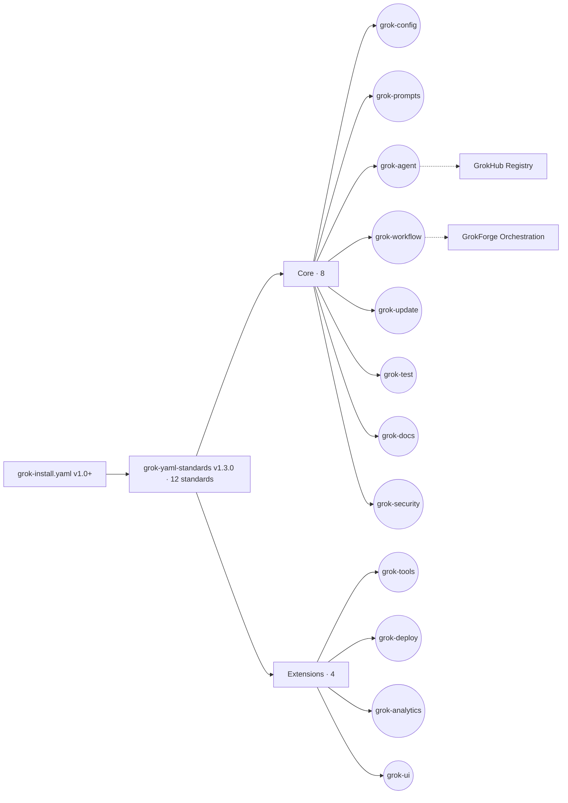

<!-- NEON / CYBERPUNK REPO TEMPLATE · GROK-YAML-STANDARDS -->

<p align="center">
  
</p>

<h1 align="center">⚡ grok-yaml-standards</h1>

<p align="center">
  <b>The official community reference library extending <code>grok-install.yaml</code>.</b><br/>
  Twelve YAML standards. Zero setup. Trigger Grok-powered features in any repo via <code>@grok</code>.
</p>

<p align="center">
  
</p>

<p align="center">
  <a href="https://opensource.org/licenses/Apache-2.0"></a>
  
  
  
  <a href="https://x.com/JanSol0s/status/2044691252327993364"></a>
  <a href="https://github.com/agentmindcloud/grok-yaml-standards"></a>
</p>

---

## ✦ What This Is

`grok-install.yaml` showed the world how a single YAML file can turn any GitHub repo into a Grok-native experience. **grok-yaml-standards** extends that with **12 drop-in YAML standards** — instant agents, workflows, prompts, security, deployments, analytics, and more — all triggered via `@grok` comments in any issue, PR, or README.

**v1.3.0** adds an optional **GrokHub Card** for registry publishing, **GrokForge Orchestration** on workflows (hybrid, graph, crew, debate_swarm modes), and 7 drop-in reference configs. Count stays at 12.

## ✦ The 12 Standards — At a Glance

<p align="center">
  
  
  
  
  
  
</p>
<p align="center">
  
  
  
  
  
  
</p>

## ✦ Why You'd Use It

<table>
  <tr>
    <td width="33%">
      <h3>⚡ Zero Setup</h3>
      <p>Copy the <code>.grok/</code> folder, drop it in any repo, tag <code>@grok</code>. That's the entire install.</p>
    </td>
    <td width="33%">
      <h3>🛡️ Schema Validated</h3>
      <p>Every standard ships with JSON Schema Draft 7. CI runs <code>yamllint</code> + <code>ajv-cli</code> on every PR.</p>
    </td>
    <td width="33%">
      <h3>🔗 Forward Compatible</h3>
      <p>All 12 standards work with <code>grok-install.yaml@1.0+</code> and <code>grok@2026.4+</code>.</p>
    </td>
  </tr>
</table>

## ✦ 30 Seconds to First Trigger

```bash
git clone https://github.com/agentmindcloud/grok-yaml-standards.git
cd grok-yaml-standards
cp -r .grok/ /your/repo/.grok/          # drop in any repo
# Then in any issue, PR, or README, add a magic comment:
# @grok spawn agent:ResearchBot
# @grok run workflow:DailyDigest
# @grok security scan
```

## ✦ Architecture



## ✦ Core Standards

| YAML File | Primary Trigger | What It Unlocks | Benefit |
|-----------|----------------|-----------------|---------|
| [`grok-config.yaml`](grok-config/) | `@grok config` | Repo-wide model settings & defaults | Consistency |
| [`grok-prompts.yaml`](grok-prompts/) | `@grok use prompts:<id>` | Reusable versioned prompt library | Creativity |
| [`grok-agent.yaml`](grok-agent/) | `@grok spawn agent:<Name>` | Persistent stateful Grok agents | Automation |
| [`grok-workflow.yaml`](grok-workflow/) | `@grok run workflow:<Name>` | Multi-step automated processes | Productivity |
| [`grok-update.yaml`](grok-update/) | `@grok update` | Smart repo & knowledge updates | Freshness |
| [`grok-test.yaml`](grok-test/) | `@grok test` | AI-powered testing & validation | Quality |
| [`grok-docs.yaml`](grok-docs/) | `@grok docs` | Auto-generated documentation | Clarity |
| [`grok-security.yaml`](grok-security/) | `@grok security scan` | Real-time security & compliance | Safety |

## ✦ Spec Extensions

| YAML File | Primary Trigger | What It Unlocks | Benefit |
|-----------|----------------|-----------------|---------|
| [`grok-tools.yaml`](grok-tools/) | `@grok tools list` | Typed tool registry for agents & workflows | Correctness |
| [`grok-deploy.yaml`](grok-deploy/) | `@grok deploy <target>` | Deployment targets, env vars, health checks | Reliability |
| [`grok-analytics.yaml`](grok-analytics/) | `@grok analytics report` | Opt-in telemetry with PII controls | Insight |
| [`grok-ui.yaml`](grok-ui/) | `@grok ui status` | Voice commands, dashboard widgets, shortcuts | Experience |

> Count authority: [`version-reconciliation.md`](version-reconciliation.md). If you see "14 standards" anywhere in the wild, it is incorrect as of v1.3.0.

## ✦ JSON Schema Validation

Every standard ships with a full JSON Schema in [`/schemas/`](schemas/). Target: **Draft 7**. Draft 2020-12 migration planned for v1.4.

<details>
<summary><b>View all 12 schemas</b></summary>

| Schema | Validates |
|--------|-----------|
| [`schemas/grok-config.json`](schemas/grok-config.json) | Model settings, privacy, shortcuts |
| [`schemas/grok-prompts.json`](schemas/grok-prompts.json) | Prompt templates, variables, output format |
| [`schemas/grok-agent.json`](schemas/grok-agent.json) | Agent definitions, tools, memory, rate limits |
| [`schemas/grok-workflow.json`](schemas/grok-workflow.json) | Workflow steps, conditions, error handling |
| [`schemas/grok-update.json`](schemas/grok-update.json) | Update jobs, schedule, actions |
| [`schemas/grok-test.json`](schemas/grok-test.json) | Test suites, alert levels, categories |
| [`schemas/grok-docs.json`](schemas/grok-docs.json) | Doc targets, sections, style presets |
| [`schemas/grok-security.json`](schemas/grok-security.json) | Scans, compliance standards, notifications |
| [`schemas/grok-tools.json`](schemas/grok-tools.json) | Tool signatures, permissions, rate limits |
| [`schemas/grok-deploy.json`](schemas/grok-deploy.json) | Deploy targets, resource limits, health checks |
| [`schemas/grok-analytics.json`](schemas/grok-analytics.json) | Event definitions, PII safety, retention |
| [`schemas/grok-ui.json`](schemas/grok-ui.json) | Voice commands, dashboard widgets, shortcuts |

</details>

Add this to VS Code `settings.json` for live validation:

```json
{
  "yaml.schemas": {
    "https://github.com/agentmindcloud/grok-yaml-standards/schemas/grok-config.json": ".grok/grok-config.yaml",
    "https://github.com/agentmindcloud/grok-yaml-standards/schemas/grok-agent.json": ".grok/grok-agent.yaml",
    "https://github.com/agentmindcloud/grok-yaml-standards/schemas/grok-tools.json": ".grok/grok-tools.yaml"
  }
}
```

Run the same validation locally:

```bash
npx ajv validate --spec=draft7 --all-errors --strict=false \
  -s schemas/grok-agent.json -d .grok/grok-agent.yaml
```

## ✦ Validation & CI

| Workflow | Trigger | What it does |
|----------|---------|--------------|
| [`validate-schemas.yml`](.github/workflows/validate-schemas.yml) | `pull_request`, `push` to `main` | `yamllint` (config: [`.yamllint`](.yamllint)) against `.grok/` + every `grok-*/example.yaml` + every `grok-*/examples/*.yaml`, then `ajv-cli` Draft 7 against each of the 12 schemas, plus a smoke check on `$id`, `title`, `description`, `$schema` |
| [`release.yml`](.github/workflows/release.yml) | `push` of a `v*` tag | Publishes a GitHub Release via `softprops/action-gh-release@v2` with auto-generated notes |

## ✦ Compatibility Matrix

| Standard | grok-install.yaml | grok | grok-yaml-standards |
|----------|------------------|------|---------------------|
| grok-config | `@1.0+` | `@2026.4+` | `@1.1+` |
| grok-prompts | `@1.0+` | `@2026.4+` | `@1.1+` |
| grok-agent | `@1.0+` | `@2026.4+` | `@1.1+` |
| grok-workflow | `@1.0+` | `@2026.4+` | `@1.1+` |
| grok-update | `@1.0+` | `@2026.4+` | `@1.1+` |
| grok-test | `@1.0+` | `@2026.4+` | `@1.1+` |
| grok-docs | `@1.0+` | `@2026.4+` | `@1.1+` |
| grok-security | `@1.0+` | `@2026.4+` | `@1.1+` |
| grok-tools *(new)* | `@1.0+` | `@2026.4+` | `@1.2+` |
| grok-deploy *(new)* | `@1.0+` | `@2026.4+` | `@1.2+` |
| grok-analytics *(new)* | `@1.0+` | `@2026.4+` | `@1.2+` |
| grok-ui *(new)* | `@1.0+` | `@2026.4+` | `@1.2+` |

## ✦ New in v1.3.0

<table>
  <tr>
    <td width="50%">
      <h3>🃏 GrokHub Card</h3>
      <p>Optional <code>hub_card</code> block on <code>grok-agent</code> for publishing agents to a discoverable registry. Opt-in; existing agents unaffected.</p>
    </td>
    <td width="50%">
      <h3>🔮 GrokForge Orchestration</h3>
      <p>Optional <code>orchestration</code> block on <code>grok-workflow</code> supporting <code>hybrid</code>, <code>graph</code>, <code>crew</code>, and <code>debate_swarm</code> modes with vector-memory backing.</p>
    </td>
  </tr>
  <tr>
    <td>
      <h3>🤖 4 Reference Agents</h3>
      <p>In <a href="grok-agent/examples/"><code>grok-agent/examples/</code></a>: <code>research-swarm-v2</code>, <code>trend-to-thread-bot</code>, <code>code-reviewer-agent</code>, <code>private-ops-agent</code>.</p>
    </td>
    <td>
      <h3>⚙️ 3 Reference Workflows</h3>
      <p>In <a href="grok-workflow/examples/"><code>grok-workflow/examples/</code></a>: <code>massive-x-research-swarm</code>, <code>debate-swarm-example</code>, <code>simple-graph-agent</code>.</p>
    </td>
  </tr>
</table>

Count stays **12**. No new schemas; no new top-level standards. Full history: [`CHANGELOG.md`](CHANGELOG.md).

## ✦ What's Coming

### v1.4 — tooling pass
- `grok-validate` CLI (Node + Go builds) wrapping `ajv` + `yamllint` against the 12 shipped schemas
- VS Code extension pre-wired to the schema registry
- JSON Schema Draft 2020-12 migration, gated on downstream compatibility testing

### v2.14 — exploratory (no commitment)
A long-horizon look at whether two extra standards (`grok-cache`, `grok-auth`) are worth adding. Tracked in [`version-reconciliation.md`](version-reconciliation.md). **Until and unless a future release explicitly bumps it, the library stays at 12 standards.**

## ✦ Related Docs

- [`ROADMAP.md`](ROADMAP.md) — path to official xAI adoption and per-version milestones
- [`CONTRIBUTING.md`](CONTRIBUTING.md) — branching convention, review flow, what we welcome
- [`SECURITY.md`](SECURITY.md) — threat model and private vulnerability reporting
- [`how-xai-can-adopt.md`](how-xai-can-adopt.md) — the pitch we hand to the xAI team
- [`standards-overview.md`](standards-overview.md) — side-by-side comparison of all 12 standards
- [`schemas/README.md`](schemas/README.md) — per-schema notes and the full VS Code snippet

## ✦ Sibling Tools

<table>
  <tr>
    <td width="33%">
      <h3>📦 grok-install</h3>
      <p>The declarative spawn manifest standard this library extends.</p>
      <a href="https://github.com/agentmindcloud/grok-install">Repository →</a>
    </td>
    <td width="33%">
      <h3>🎭 grok-agent-orchestra</h3>
      <p>Multi-agent YAML runtime with a mandatory safety veto.</p>
      <a href="https://github.com/agentmindcloud/grok-agent-orchestra">Repository →</a>
    </td>
    <td width="33%">
      <h3>🌉 grok-build-bridge</h3>
      <p>Codegen layer that composes with Orchestra and these standards.</p>
      <a href="https://github.com/agentmindcloud/grok-build-bridge">Repository →</a>
    </td>
  </tr>
</table>

## ✦ Contributors

| Contributor | Role | Contributions |
|---|---|---|
| <a href="https://github.com/JanSol0s"></a><br/>**[@JanSol0s](https://github.com/JanSol0s)** | Creator & Maintainer | v1.0.0 → v1.3.0 · All 12 standards · JSON Schemas · Compatibility matrix · Apache 2.0 relicense · X launch · Hub Card · Orchestration |

Full list + "how to be added" in [`CONTRIBUTORS.md`](CONTRIBUTORS.md). Security reports go through [`SECURITY.md`](SECURITY.md).

## ✦ Connect

<p align="center">
  <a href="https://github.com/agentmindcloud">
    
  </a>
  <a href="https://x.com/JanSol0s">
    
  </a>
  <a href="https://www.jansolos.com">
    
  </a>
</p>

## ✦ License

Apache 2.0. Made with love by the Grok community for xAI and every X user.

**Version 1.3.0** · Forward-compatible with `grok-install.yaml@1.0+` · [Launched on X April 16, 2026](https://x.com/JanSol0s/status/2044691252327993364)

<p align="center">
  
</p>
